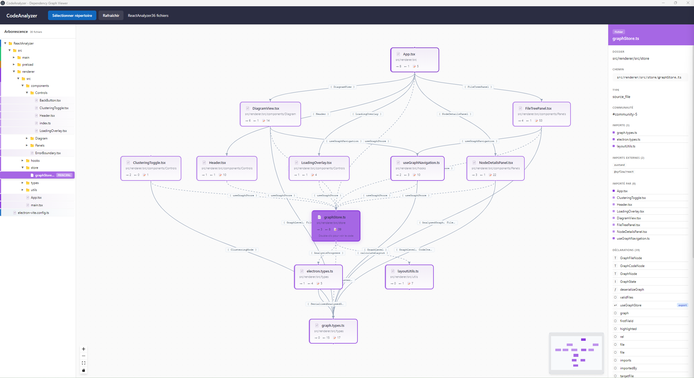

# CodeAnalyzer

Interactive dependency graph viewer for TypeScript/JavaScript projects.

## Description

CodeAnalyzer is a desktop application that analyzes source code from TypeScript/JavaScript projects and generates interactive dependency graphs with multi-level navigation.



## Features

- **Automatic Analysis** - Parses TypeScript/JavaScript/JSX/TSX files using AST
- **Three Navigation Levels**:
  - **Files Level** - Visualize file dependencies with import relationships
  - **Code Level** - Explore declarations inside a file (functions, classes, components, hooks, types)
  - **Function Logic Level** - View the internal logic flowchart of a function (if/else, loops, returns, etc.)
- **Path Alias Resolution** - Supports common aliases (`@/`, `@components/`, `~/`, etc.)
- **Smart Coloring** - Files colored by folder with HSL gradients
- **Community Detection** - Automatic grouping using Louvain algorithm
- **File Tree Panel** - Browse project structure with quick navigation
- **Details Panel** - View file imports, exports, and code declarations
- **Breadcrumb Navigation** - Navigate between levels with clickable breadcrumb
- **Auto-centering** - Smooth camera transitions when navigating

## Tech Stack

| Technology | Purpose |
|------------|---------|
| [Electron](https://www.electronjs.org/) | Cross-platform desktop app |
| [electron-vite](https://electron-vite.org/) | Build tooling with HMR |
| [React 18](https://react.dev/) | User interface |
| [TypeScript](https://www.typescriptlang.org/) | Type safety |
| [@xyflow/react](https://reactflow.dev/) | Graph visualization |
| [Zustand](https://zustand-demo.pmnd.rs/) | State management |
| [dagre](https://github.com/dagrejs/dagre) | Automatic graph layout |
| [@typescript-eslint/typescript-estree](https://typescript-eslint.io/) | AST parsing |
| [Less](https://lesscss.org/) | CSS preprocessing |

## Installation

```bash
# Clone the repository
git clone <repository-url>
cd CodeAnalyzer

# Install dependencies
npm install
```

## Usage

### Development

```bash
npm run dev
```

### Production Build

```bash
# Windows
npm run build:win

# macOS
npm run build:mac

# Linux
npm run build:linux
```

### Preview Production Build

```bash
npm run preview
```

## Architecture

```
src/
├── main/                        # Electron main process
│   ├── index.ts                 # Entry point, window management
│   ├── ipcHandlers.ts           # IPC communication handlers
│   ├── fileAnalyzer.ts          # File system traversal
│   ├── astParser.ts             # TypeScript/JSX AST parsing
│   ├── graphBuilder.ts          # Dependency graph construction
│   ├── functionLogicParser.ts   # Function logic flowchart extraction
│   ├── communityDetection.ts    # Louvain clustering algorithm
│   └── workers/
│       └── analyzerWorker.ts    # Background analysis worker
│
├── preload/
│   └── index.ts                 # Secure IPC bridge (contextBridge)
│
└── renderer/src/                # React application
    ├── App.tsx                  # Main app component
    ├── components/
    │   ├── Diagram/             # React Flow components
    │   │   ├── DiagramView.tsx  # Main graph view
    │   │   ├── FileNode.tsx     # File node component
    │   │   ├── CodeGroupNode.tsx # Grouped code items by type
    │   │   ├── LogicNode.tsx    # Function logic flowchart node
    │   │   └── ImportEdge.tsx   # Import relationship edge
    │   ├── Controls/            # Header, BackButton, Breadcrumb, LoadingOverlay
    │   └── Panels/              # FileTreePanel, NodeDetailsPanel
    ├── store/                   # Zustand state management
    ├── hooks/                   # Custom React hooks
    ├── types/                   # TypeScript type definitions
    ├── utils/                   # Utility functions
    └── styles/                  # Less stylesheets
```

## Navigation Levels

CodeAnalyzer provides three levels of drill-down navigation:

```
┌─────────────────────────────────────────────────────────────────────────────┐
│  FILES (Level 1)         CODE (Level 2)           FUNCTION LOGIC (Level 3)  │
│  ┌─────────────┐         ┌─────────────┐          ┌─────────────────────┐   │
│  │  FileNode   │ ──────► │ CodeGroup   │ ──────►  │  Flowchart Logic    │   │
│  │  FileNode   │ dbl-clk │ CodeGroup   │  click   │  (Decision, Loop,   │   │
│  │  FileNode   │         │ CodeGroup   │  on fn   │   Process nodes)    │   │
│  └─────────────┘         └─────────────┘          └─────────────────────┘   │
│                                                                             │
│  Breadcrumb: 📁 Project  ›  📄 File.tsx  ›  ƒ myFunction()                  │
└─────────────────────────────────────────────────────────────────────────────┘
```

### Level 1: Files
- View all files with their import/export relationships
- Double-click a file to drill down to Code level
- Files are colored by folder for easy identification

### Level 2: Code
- View all declarations in a file grouped by type (Functions, Classes, Types, etc.)
- Click on a function/hook/component to see its logic flowchart
- Groups can be collapsed/expanded

### Level 3: Function Logic
- Visualize the internal control flow of a function
- Node types: Entry, Exit, Decision (if/switch), Loop (for/while), Process, Return, Call, Exception
- Edges show flow direction with labels (true/false for conditions)

## Supported File Types

| Extension | Status |
|-----------|--------|
| `.ts` | Supported |
| `.tsx` | Supported |
| `.js` | Supported |
| `.jsx` | Supported |

## Path Alias Resolution

CodeAnalyzer automatically resolves common path aliases:

| Alias Pattern | Resolves To |
|---------------|-------------|
| `@/` | `src/` |
| `@components/` | `src/components/` |
| `@utils/`, `@hooks/`, `@stores/` | `src/<folder>/` |
| `@renderer/`, `@main/` | `src/renderer/`, `src/main/` |
| `~/` | `src/` |
| `#/` | `src/` |

## Ignored Directories

The analyzer skips these directories:
- `node_modules`
- `dist`, `build`, `out`
- `.git`, `.svn`
- `.next`, `.nuxt`
- `coverage`
- `.cache`

## Keyboard Shortcuts

| Action | Shortcut |
|--------|----------|
| Zoom in/out | Mouse wheel |
| Pan | Left click + drag |
| Drill down to Code | Double-click on file node |
| View function logic | Click on function in Code view |
| Select node | Single click |
| Back to previous level | Back button (top-left) |
| Navigate levels | Breadcrumb (bottom-left) |

## LLM Integration

CodeAnalyzer can generate AI-powered descriptions for each file using various LLM providers.

### Supported Providers

| Provider | Configuration | Parallelization |
|----------|---------------|-----------------|
| **OpenAI** | API Key required | Supported (3 concurrent requests) |
| **Anthropic** | API Key required | Supported (3 concurrent requests) |
| **Ollama** | Local URL (default: `http://localhost:11434`) | Not effective* |

*\*Ollama processes requests sequentially (single-threaded inference). Parallel requests are queued server-side, so parallelization provides no speed benefit.*

### Configuration

1. Click the gear icon in the header (requires a loaded project)
2. Select your LLM provider
3. Enter your API key (or Ollama URL)
4. Choose the model
5. Test the connection
6. Save the configuration

Configuration is stored per-project in `.codeanalyzer/llm-config.json`.

### Description Generation

- Descriptions are generated in parallel (3 concurrent API calls for OpenAI/Anthropic)
- Each description appears in real-time as soon as it's ready
- Descriptions are cached in `.codeanalyzer/description-cache.json`
- Cache is invalidated when file content changes (hash-based)
- Use "Refresh" to regenerate all descriptions

### Technical Details

The parallelization uses a worker pool pattern:
- A queue holds all files to process
- Up to 3 workers run concurrently
- When a worker finishes, it picks the next file from the queue
- Each completed description is sent immediately to the UI via IPC (`llm:descriptionReady`)
- Cache is saved every 5 files to prevent data loss on interruption

## Roadmap

### Phase 0 - AI Improvements
- [x] Worker for generating description for each file (provide file + imports + used)
- [ ] Worker for generating methods description
- [x] LLM API key configuration (OpenAI, Anthropic, Ollama)
- [x] Parallel description generation with real-time UI updates
- [ ] Context menu - Open file in editor (external?)
- [x] Display code logic (Function Logic level)

### Phase 1 - Core Improvements
- [ ] Parse and read `tsconfig.json` / `jsconfig.json` for accurate path alias resolution
- [ ] Support `baseUrl` and `paths` configuration
- [ ] Improve error handling for malformed files
- [ ] Add search/filter functionality in file tree
- [x] Improve code level display (grouped by type, collapsible)
- [x] Display methods logic into specific graph (Function Logic level with flowchart)
- [ ] Code review (...)
- [ ] Generate unit tests

### Phase 2 - Framework Support
- [ ] **Angular** - Support for Angular modules, components, services, and dependency injection
- [ ] **Vue.js** - Parse `.vue` single-file components (SFC)
- [ ] **Svelte** - Parse `.svelte` components
- [ ] **Next.js** - Understand App Router and Pages Router conventions
- [ ] **Nuxt** - Support Nuxt directory structure and auto-imports
- [ ] Others...

### Phase 3 - Language Support
- [ ] **Pure JavaScript** - Improve CommonJS (`require`/`module.exports`) support
- [ ] **ES Modules** - Better handling of dynamic imports
- [ ] **JSON imports** - Track JSON file dependencies
- [ ] **CSS/SCSS imports** - Visualize style dependencies
Long term goal : 
- [ ] Have an abstraction over languages (display just logic, no code specific information)
- [ ] By extension, beeing able to handle more languages


### Phase 4 - Advanced Features
- [ ] **Circular dependency detection** - Highlight and warn about circular imports
- [ ] **Dead code detection** - Find unused exports
- [ ] **Bundle impact analysis** - Estimate file sizes and import costs
- [ ] **Git integration** - Show recently modified files, blame info
- [ ] **Diff view** - Compare dependency graphs between commits/branches
- [ ] Design pattern identification
- [ ] 

### Phase 5 - Export & Integration
- [ ] **PNG/SVG export** - High-quality image export
- [ ] **JSON export** - Structured graph data for external tools
- [ ] **Mermaid export** - Generate Mermaid diagram syntax

### Phase 6 - Collaboration
- [ ] **Project presets** - Save and share analysis configurations
- [ ] **Annotations** - Add notes to files and relationships
- [ ] **Report generation** - Create documentation from analysis

### Phase 7 - Subproject extraction
- [ ] Extract project files (checkbox?) and generate a working sub-project aside based on graph logic


## Contributing

Contributions are welcome! Please feel free to submit issues and pull requests.

### Development Setup

1. Fork the repository
2. Create a feature branch: `git checkout -b feature/my-feature`
3. Make your changes
4. Run the app in dev mode: `npm run dev`
5. Commit your changes: `git commit -m 'Add my feature'`
6. Push to the branch: `git push origin feature/my-feature`
7. Open a Pull Request

## License

This project is licensed under the **GNU General Public License v3.0** (GPLv3).

See the [LICENSE](LICENSE) file for details.

```
CodeAnalyzer - Interactive dependency graph viewer
Copyright (C) 2025

This program is free software: you can redistribute it and/or modify
it under the terms of the GNU General Public License as published by
the Free Software Foundation, either version 3 of the License, or
(at your option) any later version.

This program is distributed in the hope that it will be useful,
but WITHOUT ANY WARRANTY; without even the implied warranty of
MERCHANTABILITY or FITNESS FOR A PARTICULAR PURPOSE. See the
GNU General Public License for more details.
```
